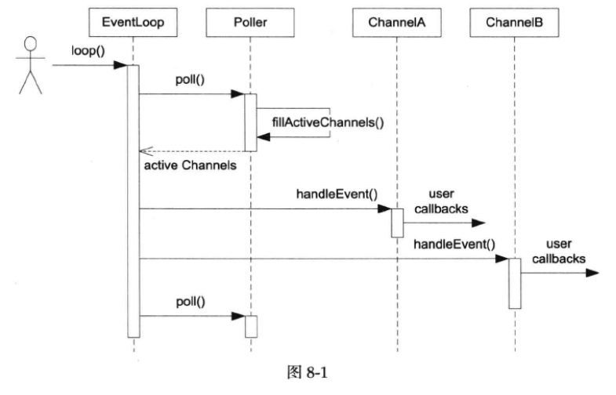

## muduo网络库设计与实现（1）

### 1、EventLoop
（1）事件循环类；

（2）不可拷贝，继承boost::noncopyable；

（3）one loop per thread，每个线程只能有一个EventLoop对象。无法跨线程调用，可以确保线程安全。创建EventLoop对象的线程是**IO线程**，其主要功能是运行事件循环EventLoop::loop()。EventLoop对象的生命期通常和其所属的线程一样长。

（4）muduo的接口设计会明确哪些成员函数是线程安全的，可以跨线程调用；哪些成员函数只能在某个特定线程调用（主要是IO线程）。为了能在运行时检查这些pre-condition，定义isInLoopThread()和assertInloopThread()等函数。

### 2、Ractor的关键结构

** Ractor最核心的事件分发机制，即将IO multiplexing 拿到的IO事件分发给各个文件描述符(fd)的事件处理函数  **

### 2.1 Channel类

（1）Channel负责将IO事件分发给描述符的事件处理函数（回调函数）。

（2）每个Channel始终只属于一个EventLoop，每个Channel对象只属于一个IO线程。每个Channel对象始终只负责一个文件描述符（fd）的IO事件分发，但并不拥有这个fd，也不会在析构的时候关闭这个fd。

（3）使用了std::function，std::function 的实例能存储、复制及调用任何可调用 (Callable) 目标——函数、 lambda 表达式、 bind 表达式或其他函数对象，还有指向成员函数指针和指向数据成员指针。用function代替函数指针，实现函数回调，灵活性更高。

（4）该类还会用更上层的封装，是其他类的直接或间接成员。

（5）只在IO线程中调用，因此更新数据成员不必加锁。

（6）Channel::handleEvent()是Channel核心，事件分发程序，EventLoop::loop()调用，功能是根据revents_的值分别调用不同的用户回调。

### 2.2 Poller类
（1）该类是IO multiplexing的封装。

（2）Poller是EventLoop的间接成员，只供Owner EventLoop在IO线程调用，因此无需加锁。其生命期与EventLoop相等。

（3）Poller不拥有Channel，Channel在析构之前必须自己unfegister（EventLoop::removeChannel()），避免空悬指针。

（4）fillActiveChannel()的复杂度是O(N)，N是pollfds_的长度，即文件描述符数目。

（5）Poller只负责IO multiplexing，不负责事件分发（dispatching）。这样将来可以方便地替换为其他高效的IO multiplexing机制。

（5）updateChannel()添加新Channel的复杂度是O(logN)，更新已有的Channel的复杂度是O（1），因为Channel记住了自己在pollfds_数组中的下标，因此可以快速定位。

