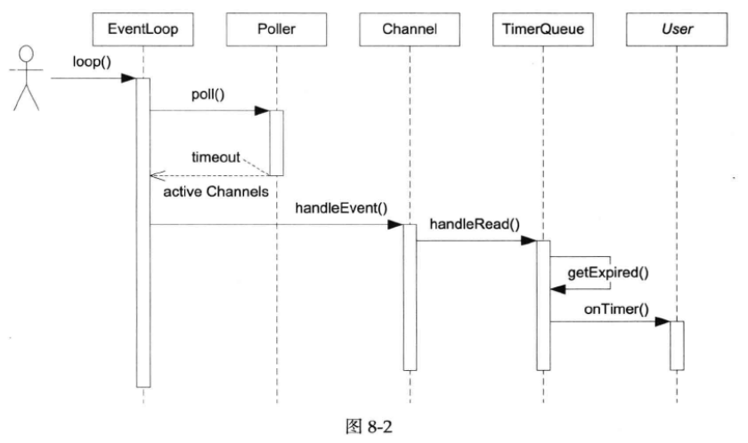

## muduo网络库设计与实现（2）

### TimerQueue定时器
给EventLoop加上定时器功能。传统的Reactor通过控制select(2)和poll(2)的等待时间来实现定时，而现在有了timerfd，可以用和处理IO事件相同的方式来处理定时。

### 1、TimerQueue Class

muduo定时器功能由三个class实现，TimerId、Timer、TimerQueue。

### TimerId:
简单的生成一个定时器指针

### Timer:
timer定时器对象，该类的作用就是创建一个定时器对象，成员包括：

**private:**

  * const TimerCallback callback_;   **//用于接受回调函数**
  
  * Timestamp expiration_;           **//期望的时间**
  
  * const double interval_;          **//重复间隔**
  
  * const bool repeat_;              **//是否重复**

**public:**

  * void run() const;                **//定时器启动**

  * Timestamp expiration() const;    **//获取定时器期望时间**

  * bool repeat() const;             **//判断定时器是否可重复执行**

  * void restart(Timestamp now);     **//重启定时器**

### TimerQueue:
定时器队列，成员包括：
**private:**

* EventLoop* loop_;        **//所处的事件循环**

* const int timerfd_;      **//申请的文件描述符,真正的定时器其实就这一个，后面会根据插入的定时器来重置timerfd**

* Channel TimerfdChannel_; **//观察timerfd_事件的Channel**

* TimerList timers_;       **//根据到期时间排好序的定时器列表**

* void handleRead();  **//当定时器事件到的时候处理事件**

* std::vector<Entry> getExpired(Timestamp now);  **//将所有到期的定时器取出**
    
* void reset(const std::vector<Entry>& expired, Timestamp now); **//将所有到期的定时器根据当前时间进行重置，并重置定时器队列的到期时间**

* bool insert(Timer* timer);    **//新的定时器插入到队列**

**public:**

* TimerId addTimer(const TimerCallback& cb, Timestamp when, double interval);   **//添加一个定时器**

该函数被EventLoop封装为更好用的

* TimerId runAt(const Timestamp& time, const TimerCallback& cb);**//创建一个不能定期重复运行的定时器，在time时刻调用定时器回调，返回一个定时器指针**

* TimerId runAfter(double delay, const TimerCallback& cb);**//创建一个不能重复定期运行的定时器，让其中的回调函数在距现在的delay时间后运行**

* TimerId runEvery(double interval, const TimerCallback& cb);**//创建一个可以定期重复运行的定时器，让其中的回调函数从现在开始定期运行**

### 书上笔记
1、**TimerQueue的数据结构的选择，** 要求能快速找到已经到期的Timer，也要能高效地添加和删除Timer。

(1)最简单的是以按到期时间排好序的线性表为数据结构，线性查找，复杂度为O(N);

(2)二叉堆组织优先队列（libev用的是更高效的4-heap），复杂度降为O(logN)，但C++标准库的make_heap()中不能高效地删除heap中间的元素；

(3)二叉搜索树，把Timer按到期事件排好序。操作复杂度仍然是O(logN)

在muduo中使用  **set<pair<Timestamp, Timer*>>**  ，以pair<Timestamp, Timer*>为key，即便两个Timer的到期时间相同，它们的地址也必然不同。

2、Timer是用裸指针管理的，需要手动delete。可以改进为unique_ptr，避免手动管理资源。

3、TimerQueue回调用户代码onTimer()的时序图如下：

