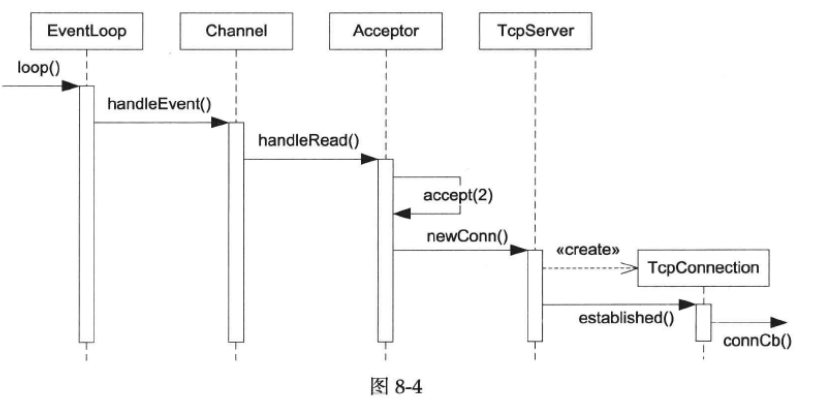
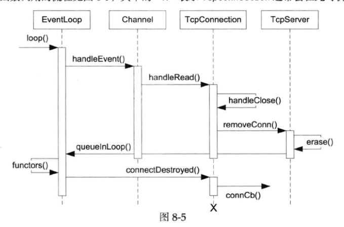
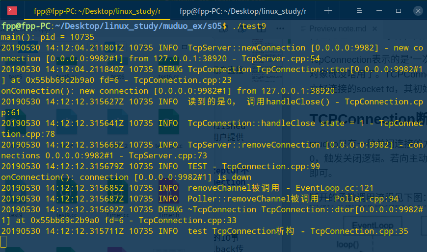

## muduo网络库实现（5）

### TcpServer接受新连接

TcpServer新建连接的相关函数调用顺序见下图：

Channel::handleEvent()触发的条件是listening socket可读，表明有新连接到达。

#### TcpServer class

TcpServer class的功能是管理accept(2)获得的TcpConnection。供用户直接使用，生命期由用户控制。

TcpServer内部使用Acceptor来获得新连接的fd，新连接到达时，回调TcpServer::newConnection，创建TcpConnection对象conn，加入ConnectionMap，设置好conn的回调，再调用conn->connectionEstablished()，其中使能conn的channel_(负责已连接的connfd的事件分发)，调用用户提供的ConnectionCallback。

***注意muduo尽量让依赖是单向的，TcpServer会用到Acceptor，但Acceptor不知道TCPServer的存在，Tcpserver会创建TCPConnection，但TCPConnection不知道TcpServer的存在。**

#### TcpConnection class

TcpConnection有一个channel_成员，通过该channel来获得socket上的IO事件，它会自己处理writeable事件，而把readable事件通过MessageCallback传达给客户。

TcpConnection表示的是“一次TCP连接”，它是不可再生的，一旦连接断开，这个TCP对象就没啥用了。TCPConnection没有发起连接的功能，其构造函数的参数是已经建立好连接的socket fd，其初始状态就是kConnecting。

### TCPConnection断开连接

muduo只有一种关闭连接的方式：被动关闭。即对方先关闭连接，本地read(2)返回0，触发关闭逻辑。若向主动关闭，可以添加forceClos()成员函数，调用handleClos()即可。

断开的函数调用流程见下图：

断开连接的测试信息如下图：

**函数调用层级太多，在函数调用时打印信息**

TcpConnection::connectDestroyed()是TCPConnection析构前最后调用的一个成员函数，它通知用户连接已断开。

通常TcpServer的生命期长于它建立的TCPConnection，因此不用担心TcpServer对象失效。在muduo中，Tcpserver的析构函数会关闭连接，因此也是安全的。

EventLoop新增removeChannel()成员函数，调用Poller::removeChannel()，复杂度为O(logN)，其中从数组pollfds_中删除元素是O(1)复杂度，办法是将待删除的元素与最后一个元素交换，再pollfds_.pop_back()。