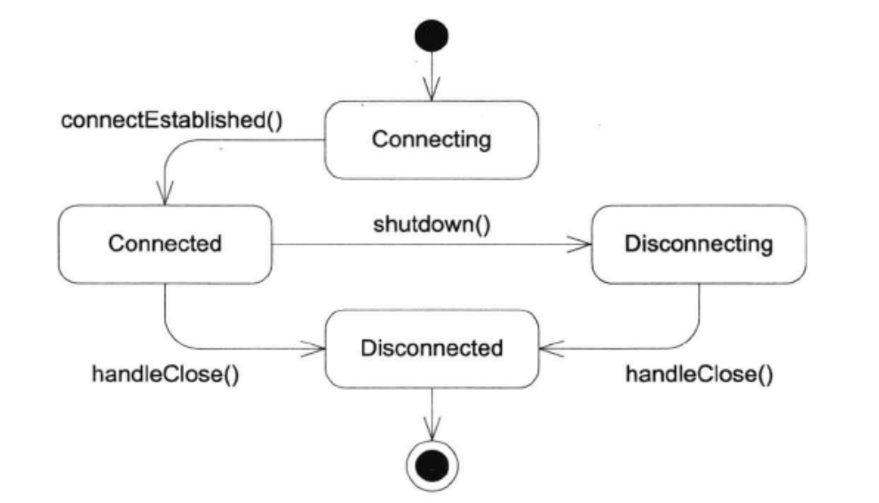

## muduo网络库实现（7）

### TcpConnection发送数据

新增了send()和shutdown()两个函数，这两个函数都可以跨线程调用

TcpConnection有一个非常简单的状态图。

shutdown()是线程安全的，它会把实际工作放到shutdownInLoop()中来做，后者保证在IO线程调用。

send()如果在非IO线程调用，它会把message复制一份，传给IO线程中的sendInLoop()来发送。有轻微效率损失，但是线程安全。C++11中可以使用移动语义，避免内存拷贝的开销。

sendInLoop()会先尝试直接发送数据，如果一次发送完毕就不会启用WriteCallback；如果只发送了部分数据，则把剩余的数据放入outputBuffer_，并开始关注writeable事件，以后在handleWrite()中发送剩余的数据。如果当前outputBuffer_已经有待发送的数据，那么就不能尝试先发送了，会造成数据乱序。
